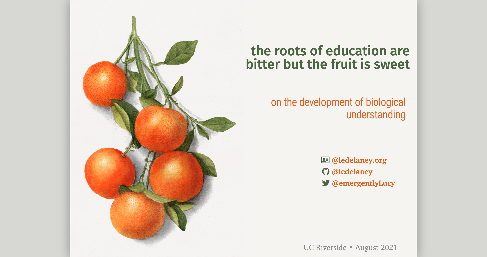

the roots of education are bitter but the fruit is sweet: a quote widely (mis)attributed to Aristotle, much to the chagrin of Aristotelian philosophers

🎞️ [View Slide Deck](https://ledelaney.org/talks/2021ucr/)

## Slides

Libraries and preliminary `HTML` file created with the R package `xaringan`, built on `remark.js`. The rest was (poorly) hard-coded the old-fashioned way by me. See [`references.pdf`](https://github.com/ledelaney/08-21-UCR/blob/main/extras/references.pdf) for references slide citations.

### Images

Originate from [RawPixel](https://www.rawpixel.com/category/53/public-domain), an incredible resource of public domain images. (Found trawling the GitHub pages of [@apreshill](https://github.com/apreshill).) Many were modified later in Illustrator.

+ [Vintage oranges illustration from U.S. Department of Agriculture Pomological Watercolor Collection](https://www.rawpixel.com/image/2289587/free-illustration-image-orange-fruit-leaves)
+ [Walnut (_Persica violacea_) from Pomona Italiana (1817 - 1839) by Giorgio Gallesio](https://www.rawpixel.com/image/321652/free-illustration-image-fruit-botanical-book)
+ [Avocados (_Persea_) (1937) by anonymous from U.S. Department of Agriculture Pomological Watercolor Collection](https://www.rawpixel.com/image/2260210/free-illustration-image-fruit-food)
+ [Vintage branch of blackberry](https://www.rawpixel.com/image/2289532/free-illustration-image-fruit-blackberry-berry)
+ [Two apples on a branch (1834–1895) by Johannes Reekers (II) from The Rijksmuseum](https://www.rawpixel.com/image/843193/still-life-apples)
+ [Vintage halved peach illustration from U.S. Department of Agriculture Pomological Watercolor Collection](https://www.rawpixel.com/image/2289569/free-illustration-image-peach-fruit-watercolor)
+ [Vintage strawberry illustration from U.S. Department of Agriculture Pomological Watercolor Collection](https://www.rawpixel.com/image/2297703/free-illustration-image-strawberry-food-fruit)
+ [Hand drawn lemon from Biodiversity Heritage Library](https://www.rawpixel.com/image/2880124/free-illustration-image-lemon-fruit-plant)
+ [Hand drawn pear from Biodiversity Heritage Library](https://www.rawpixel.com/image/2880295/free-illustration-image-fruit-pear-vintage-food)
+ [Hand drawn pineapple from Biodiversity Heritage Library](https://www.rawpixel.com/image/2880507/free-illustration-image-pineapple-tropical-fruit)
+ [Citrus from Traité des Arbres et Arbustes que l'on cultive en France en pleine terre (1801–1819) by Pierre-Joseph Redouté](https://www.rawpixel.com/image/569576/citrus-type)
+ [1. Blood orange (_Aurantium hierochunticum_) 2. Bigarade orange (_Bigarradia della bizarria_) from Traité des Arbres et Arbustes que l’on cultive en France en pleine terre (1801–1819) by Pierre-Joseph Redouté](https://www.rawpixel.com/image/569582/blood-orange)
+ [Delicious red cherries illustration from U.S. Department of Agriculture Pomological Watercolor Collection](https://www.rawpixel.com/image/2297988/free-illustration-image-fruit-cherry-botanical)
+ [Vintage halved pomegranate illustration from U.S. Department of Agriculture Pomological Watercolor Collection](https://www.rawpixel.com/image/2297919/free-illustration-image-fruit-pomegranate-food)
+ [Delicious purple plum in a branch illustration from U.S. Department of Agriculture Pomological Watercolor Collection](https://www.rawpixel.com/image/2289575/free-illustration-image-fruit-leaves-plum)
+ [_Citrus decumana_ from Traité des Arbres et Arbustes que l'on cultive en France en pleine terre (1801–1819) by Pierre-Joseph Redouté](https://www.rawpixel.com/image/569539/grapefruit-branch)